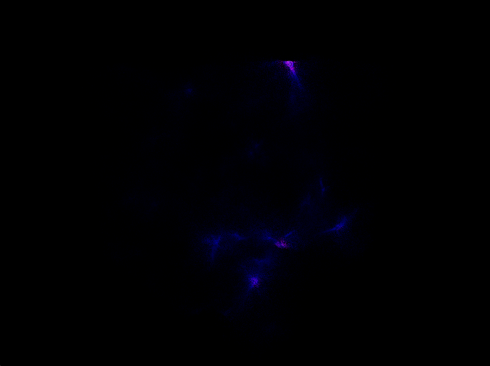
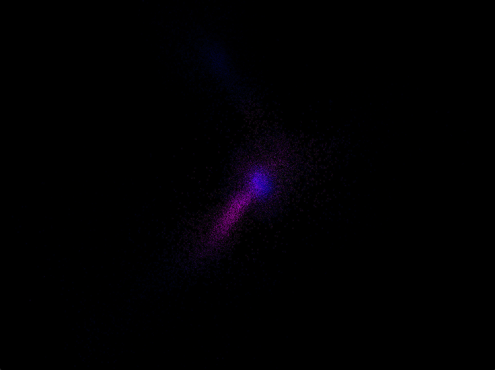

# Hermes

Hermes is a cosmological simulation engine built on [morphis](https://github.com/ctl-alt-leist/morphis-rs), a geometric algebra library. Named for the messenger god who moves between scales, Hermes implements the dynamical simulation layer of the Hierarchical Closure Dynamics framework -- a multi-scale approach to cosmological structure formation where coarse-grained state spaces are connected bidirectionally to fine-grained patches via restriction and prolongation operators.

<figure style="text-align: center; margin: 2em auto;">
  
  <figcaption style="margin: 0.5em auto 0 auto; font-style: italic; text-align: justify; width: 80%; max-width: 80%;">
    Dark matter density field evolved by the Schrodinger-Poisson integrator. The field α lives in the even subalgebra of the geometric algebra and is rendered as volumetric point sprites with additive blending.
  </figcaption>
</figure>

## Features

- **Particle-mesh N-body**: FFT-based Poisson gravity with cloud-in-cell mass assignment
- **Schrodinger-Poisson field theory**: split-step spectral integrator for fuzzy dark matter in the even subalgebra
- **Content abstraction**: particles, fields, or both -- pluggable dynamics per content type
- **Geometric algebra substrate**: all physical quantities are morphis objects -- positions, momenta, forces are grade-1 vectors; angular momentum is a grade-2 bivector; the dark matter field α is an even-subalgebra field
- **Symplectic integration**: kick-drift-kick leapfrog (particles) and Strang splitting (fields) with cosmological step factors
- **Pipeline architecture**: simulation, disk I/O, and visualization run on independent threads connected by bounded channels
- **Volumetric rendering**: additive-blended Gaussian point sprites for field visualization; standard point rendering for particles
- **Resume from snapshot**: continue a simulation from its last saved state with `--resume`
- **TOML configuration**: four-tier hierarchy with deep merge (defaults, scene, user file, CLI)
- **Snapshot I/O**: bincode serialization with morphis vector roundtrip fidelity

## Quick Start

```bash
# Run the cosmic web (default scene, 64^3 particles)
cargo run --release --features vis -- --scene cosmic-web-pm

# Run cosmic web field theory (Schrodinger-Poisson)
cargo run --release --features vis -- --scene cosmic-web-field

# Run galaxy group (3 colliding halos)
cargo run --release --features vis -- --scene galaxy-group-pm

# Play back saved snapshots
cargo run --release --features vis -- --playback data/cosmic-web-pm --fps 30

# Resume a simulation forward in time
cargo run --release --features vis -- --resume data/cosmic-web-pm --scene cosmic-web-pm configs/resume.local.toml

# See all options
cargo run --release -- --help
```

## Scenes

### Cosmic Web

<figure style="text-align: center; margin: 2em auto;">
  
  <figcaption style="margin: 0.5em auto 0 auto; font-style: italic; text-align: justify; width: 80%; max-width: 80%;">
    Cosmic web at z = 0. Zel'dovich-initialized particles evolved by the particle-mesh method in a 100 Mpc periodic box. Filaments, voids, and nodes emerge from linear perturbations.
  </figcaption>
</figure>

### Galaxy Group

<figure style="text-align: center; margin: 2em auto;">
  
  <figcaption style="margin: 0.5em auto 0 auto; font-style: italic; text-align: justify; width: 80%; max-width: 80%;">
    Three NFW dark matter halos after gravitational merger in an 8 Mpc box. The halos were initialized with infall velocities toward their common center of mass.
  </figcaption>
</figure>

## CLI

```
hermes [OPTIONS] [CONFIG_FILE]

Arguments:
  [CONFIG_FILE]        TOML config file (overrides defaults)

Options:
  --scene <NAME>       Simulation scene [default: cosmic-web-pm]
  --live               Open live 3D viewer (requires --features vis)
  --save [DIR]         Save snapshots (default: data/<scene>/)
  --no-save            Don't save snapshots
  --playback DIR       Play back saved snapshots
  --resume DIR         Resume simulation from last snapshot in directory
  --record FILE        Record playback as GIF
  --fps N              Playback/recording framerate [default: 30]
  --seed N             RNG seed [default: 42]
  --steps N            Override time steps
  --particles N        Override particles per side
  --grid N             Override grid cells per side
  -q, --quiet          Suppress output
```

## Documentation

- [Project Overview](docs/0_project-overview.md) -- scope, architecture, and reading guide
- [Particle-Mesh Method](docs/1_particle-mesh.md) -- the PM force chain and its implementation
- [Field Theory](docs/2_field-theory.md) -- even-subalgebra fields and Schrodinger-Poisson dynamics
- [HCD Context](docs/3_hcd-context.md) -- how hermes connects to the multi-scale framework
- [Pipeline Architecture](docs/4_pipeline.md) -- threading, channels, and data flow
- [Configuration](docs/5_configuration.md) -- TOML schema and config hierarchy
- [Unified Engine Plan](docs/a_plans-for-a-unified-engine.md) -- content-driven physics composition
- [Efficient Snapshots Plan](docs/b_plan-for-efficient-snapshots.md) -- I/O bottleneck analysis

## Development

| Command | Description |
|---------|-------------|
| `make lint` | `cargo fmt` + `cargo clippy --fix` |
| `make test` | `cargo test` |
| `make build` | `cargo build --release` |
| `make clean` | `cargo clean` + remove `.DS_Store` |

Pre-commit hooks enforce `cargo fmt --check`, `cargo clippy -- -D warnings`, and `cargo test` on every commit.

## License

MIT

---

Built with [morphis](https://github.com/ctl-alt-leist/morphis-rs) geometric algebra. Developed with [Claude Code](https://claude.ai/code).
