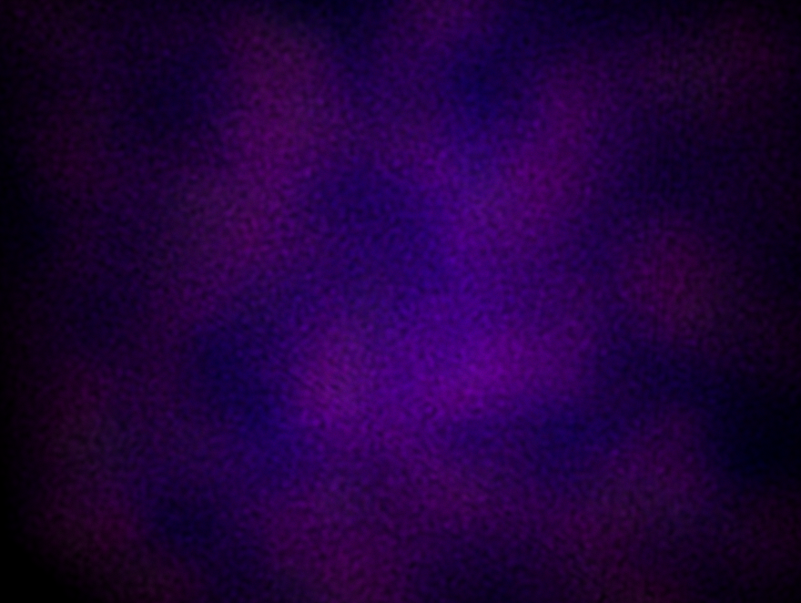
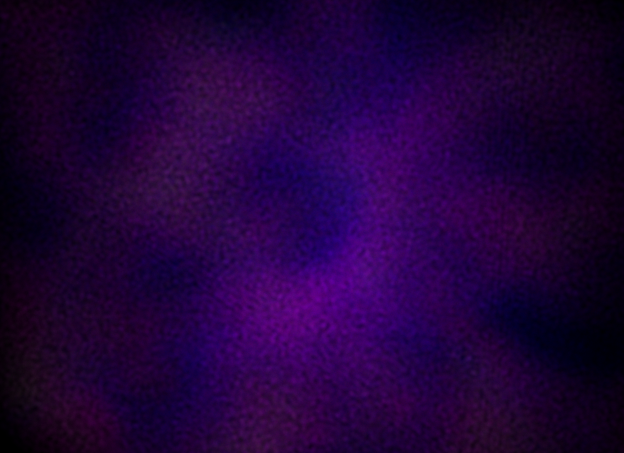

# Field Theory

The field-theoretic sector of hermes uses the morphis library's field abstraction: spatially-varying geometric algebra objects on periodic grids with spectral differential operators. This document describes the field types, their operations, and how they are used in the Schrodinger-Poisson dynamics.

| Early (z ~ 10) | Late (z ~ 0) |
|:-:|:-:|
|  |  |

The fuzzy-DM scene: volumetric rendering of the dark matter field density $|\alpha|^2$ at early and late times. Overdensities concentrate under self-gravity, with quantum pressure preventing collapse below the de Broglie scale.

## Motivation

Hermes already has its own `Grid`, `ScalarField`, and `VectorField` types in `physics/`, purpose-built for the PM force chain. These work well for particle-mesh dynamics but are limited to grades 0 and 1, with no notion of grade algebra or differential operators beyond the Poisson solver. The wavefunction formulation of fuzzy dark matter (FDM) requires fields valued in the even subalgebra $G^0 \oplus G^3$, along with gradient, Laplacian, and Laplacian-inverse operators that respect grade structure. Rather than bolt these onto hermes's bespoke field types, the natural home is morphis — where the grade algebra already lives.

The morphis field layer is not a replacement for hermes's existing PM infrastructure. The PM grid uses discrete finite-difference wavenumbers tuned to the CIC kernel, while morphis uses exact spectral wavenumbers suited to smooth field theories. Both will coexist: hermes keeps its PM pipeline for N-body dynamics, and uses morphis fields for the wavefunction sector.

## Grid

`Grid<D>` is a periodic box geometry in $D$ dimensions. It stores the cell count per side, the box length, and the derived cell length:

```rust
use morphis::grid::Grid;

let grid = Grid::<3>::new(64, 100.0);
// 64 cells per side, box length 100 Mpc/h
// cell_length = 100.0 / 64 ≈ 1.5625
// n_points = 64^3 = 262,144
```

The grid provides wavenumber calculations for spectral operations. For frequency index $m$ on a grid of $N$ cells with box length $L$:

$$
k_m = \frac{2\pi m}{L}, \quad m \in \{0, 1, \ldots, N/2, -(N/2-1), \ldots, -1\}
$$

where indices above $N/2$ are interpreted as negative frequencies. The method `grid.wavenumber(m)` handles this wrapping, and `grid.k_squared(&[m0, m1, m2])` returns $|k|^2 = \sum_a k_a^2$ for a frequency multi-index.

This is morphis's `Grid<D>`, not hermes's `Grid` — they serve different purposes. Hermes's grid carries periodic wrapping utilities for particle positions and discrete Green's function wavenumbers. Morphis's grid is the domain geometry for smooth field operations.

## Field

`Field<D>` holds a grade-$k$ geometric algebra element at each grid point. The internal storage is a single `ArrayD<f64>` with shape $[N]^D \| [D]^k$ — spatial axes followed by tensor axes.

### Construction

Four constructors cover the common cases:

```rust
use morphis::field::Field;

// Zero field of any grade
let f = Field::zeros(grade, &grid, metric);

// Every point holds the same morphis Vector
let uniform = Field::constant(&some_vector, &grid);

// Scalar field from a function of position
let rho = Field::scalar_field(&grid, metric, |x| {
    (2.0 * PI * x[0] / L).sin()
});

// Any-grade field from a function returning Vector<D>
let velocity = Field::from_fn(1, &grid, metric, |x| { ... });
```

### Pointwise Access

Each grid point holds a morphis `Vector<D>`, extracted and inserted by spatial index:

```rust
let v: Vector<3> = field.at(&[m, n, p]);
field.set(&[m, n, p], &v);
```

This is the bridge between the field abstraction and the existing morphis algebra. Any operation that works on `Vector<D>` can be applied pointwise by extracting, operating, and inserting — though the lifted operations below are more efficient.

### Pointwise Algebra

Binary and unary operations that make sense pointwise on vectors are lifted to fields:

| Operation | Signature | Grade |
|-----------|-----------|-------|
| `&f + &g` | `Field + Field` | same |
| `&f - &g` | `Field - Field` | same |
| `-&f` | `-Field` | same |
| `&f * s` | `Field * f64` | same |
| `f.rev()` | `Field → Field` | same |
| `f.norm_squared()` | `Field → Field` | 0 |
| `Field::wedge(&f, &g)` | `Field × Field → Field` | $j + k$ |
| `Field::interior_left(&f, &g)` | `Field × Field → Field` | $k - j$ |
| `Field::scalar_product(&f, &g)` | `Field × Field → Field` | 0 |

The wedge and interior products call the corresponding morphis operations pointwise. Grade propagation follows the algebraic rules: wedge raises, interior product lowers.

### Integration

For scalar fields, `f.integrate()` returns $\int f  \  dV$ as a volume-weighted sum, and `f.sum()` returns the unweighted sum over all grid points.

## Spectral Derivatives

All derivatives are computed in Fourier space via complex-to-complex FFT (ndrustfft). The implementation transforms each scalar component of the tensor independently: extract, FFT in all $D$ spatial dimensions, multiply by the spectral operator, inverse FFT, write back.

### Partial Derivative

`f.partial(a)` differentiates with respect to spatial axis $a$. In Fourier space this is multiplication by $ik_a$. Grade-preserving.

### Gradient

$$
\nabla f = \sum_a e_a \wedge \partial_a f
$$

`f.grad()` raises grade by 1 via the exterior derivative. For a scalar field this produces a vector field; for a vector field, a bivector field.

### Divergence

$$
\nabla \cdot f = \sum_a e_a  \  \lrcorner  \  \partial_a f
$$

`f.div()` lowers grade by 1 via the interior derivative. For a vector field this produces a scalar field.

### Curl

`f.curl()` is the exterior derivative — identical to `grad()` in the GA formulation. For a vector field in 3D, the result is a bivector field (the curl). The distinction from the traditional cross-product curl is that the result lives at its natural grade rather than being mapped through the Hodge dual.

### Laplacian

$$
\nabla^2 f = -|k|^2 \hat{f}(k)
$$

`f.laplacian()` is grade-preserving and spectrally exact. Each component is multiplied by $-|k|^2$ in Fourier space.

### Laplacian Inverse (Poisson Solve)

`f.laplacian_inverse()` solves $\nabla^2 \phi = f$ by dividing Fourier coefficients by $-|k|^2$, with the zero mode set to zero. This returns the unique zero-mean solution on the periodic domain.

For hermes, the gravitational potential from a density field is:

```rust
let phi = (&rho * (4.0 * PI * G)).laplacian_inverse();
```

The physics is in the prefactor; the mathematics is in the solve.

### Identities

The spectral implementation satisfies these exactly (to machine precision):

- $\nabla \cdot (\nabla f) = \nabla^2 f$ — Hodge identity
- $\nabla \wedge (\nabla f) = 0$ — $d^2 = 0$, exterior derivative squared
- $\nabla^2 (\nabla^{-2} f) = f$ — Poisson roundtrip (zero-mean fields)

These are tested in `tests/field.rs` on analytic solutions (derivatives of sinusoids) and verified to hold within $10^{-10}$.

## Even Subalgebra Field

`EvenField<D>` represents a field valued in $G^+ = G^0 \oplus G^D$. In 3D with the Euclidean metric, the pseudoscalar $I = e_1 \wedge e_2 \wedge e_3$ satisfies $I^2 = -1$, making the even subalgebra isomorphic to the complex numbers. Each grid point stores $\alpha = a + bI$.

This is the natural representation of a Schr&ouml;dinger-like wavefunction in the geometric algebra formulation. The amplitude and phase are encoded as the scalar and pseudoscalar parts:

$$
\alpha(x) = \sqrt{\frac{\rho(x)}{m}}  \  \exp\left(\frac{i S(x)}{\hbar}\right) = \sqrt{\frac{\rho(x)}{m}} \left(\cos\frac{S}{\hbar} + I \sin\frac{S}{\hbar}\right)
$$

### Storage

Internally, `EvenField<D>` stores two real arrays of shape $[N]^D$:

```rust
pub struct EvenField<const D: usize> {
    pub scalar: ArrayD<f64>,        // a(x)
    pub pseudoscalar: ArrayD<f64>,  // b(x), coefficient of I
    pub metric: Metric<D>,
    pub grid: Grid<D>,
}
```

This is more efficient than a general `MultiVector` field and enforces the algebraic constraint that only grades 0 and $D$ are present.

### Operations

| Operation | Meaning |
|-----------|---------|
| `psi.rev()` | Complex conjugation: $(a + bI) \to (a - bI)$ |
| `psi.mul(&other)` | Complex multiplication: $(ac - bd) + (ad + bc)I$ |
| `psi.norm_squared()` | $a^2 + b^2$ as a scalar `Field<D>` |
| `psi.rotate_phase(&angle)` | Multiply by $\exp(I\theta)$ pointwise |
| `psi.density(mass)` | $\rho = m(a^2 + b^2)$ as a scalar `Field<D>` |
| `psi.integrate_norm_squared()` | Conserved norm $\int |\alpha|^2  \  dV$ |
| `psi.at(&indices)` | Extract as `MultiVector<D>` at a grid point |

### Spectral Operations

- `psi.laplacian()` — spectral Laplacian applied componentwise, returns `EvenField<D>`
- `psi.gradient_components()` — returns `[grad(scalar), grad(pseudoscalar)]` as two grade-1 vector fields, with Nyquist mode zeroing
- `psi.kinetic_energy_density()` — gradient energy density $\frac{1}{2}(|\nabla a|^2 + |\nabla b|^2)$
- `psi.integrate_norm_squared()` — conserved norm $\int |\alpha|^2  \  dV$

### Madelung Representation

The Madelung decomposition connects the wavefunction to fluid variables. The inverse takes a density field and a velocity *potential* (not the velocity directly) and constructs the wavefunction:

- `EvenField::madelung_inverse(&density, &velocity_potential, mass, diffusivity)` — builds $\alpha$ from $\rho$ and $\phi_v$
- `psi.madelung_velocity(diffusivity)` — extracts velocity field $v_d = \frac{\nu}{|\alpha|^2}(a  \  \partial_d b - b  \  \partial_d a)$

The asymmetry in the inverse signature is structural: the velocity potential $\phi_v$ (where $\mathbf{v} = \nabla \phi_v$) produces a smooth, bounded phase, while $\mathbf{v} \cdot \mathbf{x}$ grows linearly with distance and aliases on the lattice.

### Phase Rotation and Split-Step Integration

`rotate_phase` is the operation that makes split-step time integration work. The cosmological Schr&ouml;dinger equation

$$
\ell  \  \mathbb{1}  \  \partial_t \alpha = -\frac{\ell^2}{2  \  m_\alpha  \  a^2} \nabla^2 \alpha + m_\alpha  \  \Phi  \  \alpha
$$

separates into kinetic and potential operators under Strang splitting. One full timestep uses the K-V-K ordering (kinetic half, potential full, kinetic half):

1. **Kinetic half-step** (Fourier space): phase rotation by $\theta = -\ell  \  |k|^2  \  \Delta t / (2  \  m_\alpha  \  a^2)$
2. **Potential full step** (real space): Poisson solve for $\Phi$, then phase rotation by $\theta = -m_\alpha  \  \Phi  \  \Delta t / \ell$
3. **Kinetic half-step** (repeat step 1)

The $a^{-2}$ in the kinetic term arises from the comoving Laplacian: $\nabla^2_\text{phys} = a^{-2} \nabla^2_\text{comoving}$. Each factor is exactly unitary in floating-point arithmetic — the kinetic phase has unit modulus per mode and the potential phase has unit modulus per cell — so the integrated norm $\int |\alpha|^2  \  dV$ is preserved to machine precision regardless of $\Delta t$.

This is implemented in `core::schrodinger_dynamics` as the `SchrodingerPoissonDynamics` integrator. The kinetic step uses R2C FFT (via `physics::spectral`) for the scalar and pseudoscalar components independently. The potential step uses morphis's `laplacian_inverse` for the Poisson solve.

## Boundary with Hermes

The morphis field layer provides the mathematical substrate. Everything that is pure mathematics — grids, grade-aware fields, differential operators, even-subalgebra algebra, spectral solves — lives in morphis. Everything that is physics — coupling constants, cosmological scale factors, split-step orchestration, initial conditions, diagnostics — lives in hermes.

The key types and where they belong:

| Concept | morphis | hermes |
|---------|---------|--------|
| Grid geometry | `Grid<D>` | PM `Grid` (finite-difference) |
| Scalar/vector fields | `Field<D>` (any grade) | `ScalarField`, `VectorField` (PM) |
| Wavefunction | `EvenField<D>` | — |
| Madelung transform | `madelung_inverse`, `madelung_velocity` | — |
| Poisson solve | `f.laplacian_inverse()` (spectral) | `PoissonSolver` (discrete Green's) |
| Gradient/divergence | `f.grad()`, `f.div()` | — |
| R2C FFT helpers | — | `physics::spectral` |
| Physical constants | — | `constants.rs` |
| Cosmology | — | `cosmology.rs` |
| Time integration | — | `integrator.rs` (KDK), split-step |
