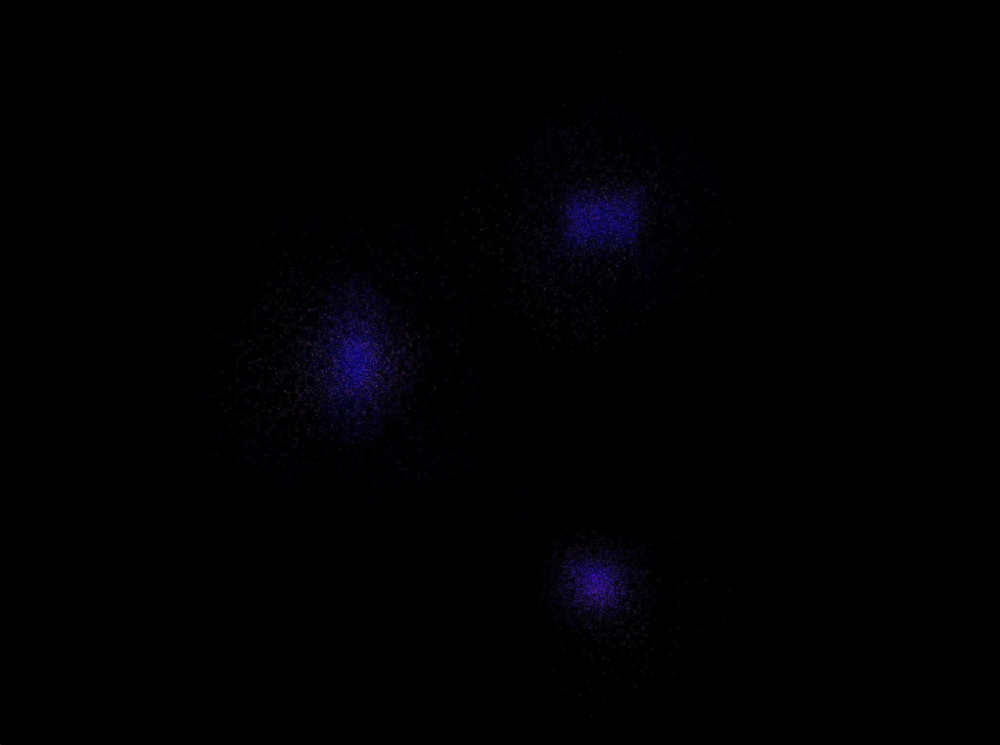

# HCD Context

Hermes is the simulation layer of the Hierarchical Closure Dynamics framework. This document describes how the current scale-0 PM implementation connects to the multi-scale machinery described in the project notes, and what each future extension requires from the codebase.

## The Framework

The generator-equation form at every scale $s$:

$$
\dot{Ψ}^{(s)} = G^{(s)} Ψ^{(s)} + S^{(s)} + C^{(s)} + A^{(s)}
$$

- $G^{(s)}$: resolvable generator (the physics we can compute at this scale)
- $S^{(s)}$: sources (chemical, radiative)
- $C^{(s)}$: closure correction (zero at the finest scale, learned at coarser scales)
- $A^{(s)}$: external accretion and boundary contributions

The key structural commitment: $C^{(s)}$ is parametrized as a rate matrix with zero column sums, so conservation is structural rather than enforced by penalty.

## Scale 0: What We Have

Two dynamical modes at scale 0, unified by the Content abstraction:

**Particle-mesh (PM):**
- **State:** $Ψ^{(0)} = (\{x_n\}, \{p_n\}, a)$ with $g_{\max}(0) = 1$ (scalars and vectors only)
- **Generator:** $G^{(0)}$ is the FFT-Poisson gravitational force chain
- morphis used for positions, momenta (grade-1), angular momentum diagnostic (grade-2)

**Schrodinger-Poisson (SP):**
- **State:** $Ψ^{(0)} = (α, a)$ where $α \in G^+(\mathbb{R}^3)$ is an even-subalgebra wavefunction
- **Generator:** split-step spectral integrator with kinetic (FFT phase rotation) and potential (Poisson + phase rotation) operators
- morphis used as the primary mathematical substrate: $α$ is an `EvenField<3>`, density extraction and phase rotation are morphis operations

Both share:
- **Closure:** $C^{(0)} = 0$ (no sub-grid corrections yet)
- **Sources:** $S^{(0)} = 0$ (dark matter only, no chemistry)
- **Accretion:** $A^{(0)} = 0$ (periodic box, no external inflow)

The `Content` enum (Particles / Fields / Mixed) and the `Dynamics` trait allow both modes to coexist. Each scene selects its content type and dynamics at initialization. The simulation driver is content-agnostic.

## Grade Activation

The grade-activation function $g_{\max}(s)$ determines which algebraic grades are dynamically present at scale $s$:

| Scale | $g_{\max}$ | Active grades | Physical content |
|-------|-----------|---------------|------------------|
| $s = 0$ (cosmological) | 1 | scalars, vectors | density, velocity, force |
| $s = 1$ (galactic) | 2 | + bivectors | magnetic field, angular momentum, vorticity |
| $s = 2$ (stellar) | 3 | + trivectors | full Clifford algebra |

This is where the framework's algebraic content becomes substantive. At scale 0, using morphis for positions and momenta is notational. At scale 1, the bivector magnetic field $B$ is a genuinely grade-2 object -- an oriented plane, not a pseudovector -- and the restriction operator $R^{(0 \leftarrow 1)}$ must project it out via grade truncation. morphis's `wedge`, `interior_left`, and `project` operations become load-bearing.

## Extension Path: Baryonic Gas

Adding Eulerian finite-volume hydrodynamics at scale 0 (from the follow-up design note):

- **New state fields:** $ρ_b$, $m_b$, $E_b$ on the grid (density, momentum density, energy density)
- **New generator:** MUSCL-Hancock + HLLC Riemann solver, Strang-split with the leapfrog
- **Coupling:** through the shared Poisson potential (total density = DM + gas)
- **Grade unchanged:** still $g_{\max}(0) = 1$, no new algebraic structure
- **Implementation:** new `physics::hydro` module, extend `Simulation` state

## Extension Path: Scale Transition

Adding a finer scale $s = 1$ (zoom patches with MHD):

- **Restriction** $R^{(0 \leftarrow 1)}$: spatial averaging + grade projection ($π_{\text{grade} \leq 1}$)
- **Prolongation** $P^{(1 \leftarrow 0)} = P_{\text{refine}} + P_{\text{expand}}$:
  - $P_{\text{refine}}$: deterministic interpolation, grade-preserving
  - $P_{\text{expand}}$: generates bivector content (seed magnetic field from prior)
- **Compatibility:** $R \circ P_{\text{refine}} = \mathbb{1}$, $R \circ P_{\text{expand}} = 0$
- **Boundary conditions:** bulk-weight decomposition (Dirichlet-like + Neumann-like)

This is where morphis's outermorphism and grade-projection machinery become essential. The restriction operator is an outermorphism composed with grade truncation. The prolongation operator's expansion component must generate grade-2 content from grade-0 and grade-1 inputs.

## Extension Path: Learned Closure

The cleanest extension: $C^{(0)}$ becomes a rate-matrix-parametrized neural network:

$$
\dot{Ψ}^{(s)} = [G^{(s)} + δQ^{(s)}] Ψ^{(s)} + S^{(s)} + A^{(s)}
$$

where $δQ^{(s)}$ has non-negative off-diagonals and zero column sums. This ensures conservation structurally. The closure slot is already wired into the generator equation; the value flowing through it changes from zero to a learned correction.

## Boundary Between morphis and hermes

- **morphis knows:** elements, products, linear maps, decompositions, norms, rotors
- **morphis doesn't know:** grids, time integration, loss functions, physical units, particles
- **hermes knows:** adaptive mesh hierarchy, closure terms, conservation monitoring, zoom triggers, the force chain, snapshot I/O, visualization

The bridge is `src/algebra.rs`: the shared Euclidean 3-metric and conversion utilities between flat array storage (for FFT/CIC hot paths) and morphis grade-1 vectors (for all algebraic operations).

<figure style="text-align: center; margin: 2em auto;">
  
  <figcaption style="margin: 0.5em auto 0 auto; font-style: italic; text-align: justify; width: 80%; max-width: 80%;">
    Three NFW dark matter halos at initialization, before gravitational interaction. Each halo has an infall velocity toward the group center of mass.
  </figcaption>
</figure>

## Scene System

The `scenes/` module provides the `Scene` trait for different simulation setups. Each scene returns a `(Content, Box<dyn Dynamics>)` pair. Current scenes:

- **cosmic-web-pm:** Zel'dovich PM in a 100 Mpc box (64^3 default)
- **cosmic-web-field:** Schrodinger-Poisson wavefunction in a 10 Mpc box (64^3 default)
- **galaxy-group-pm:** 3 colliding NFW halos in an 8 Mpc box (32^3 default)

The long-term direction is a unified engine where scenes are convenience presets for content + physics module selection, and any snapshot can be resumed without specifying a scene (see `docs/unified-engine.md`).
